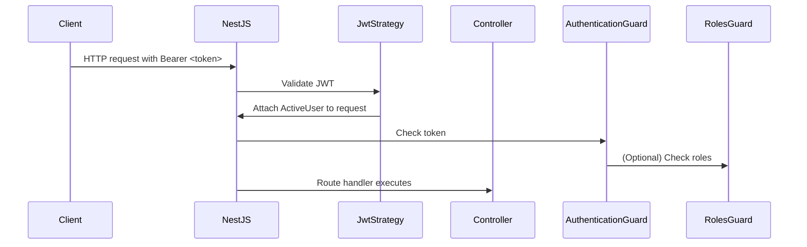

# 🔐 Authentication & Authorization in `nest-craft`

This document explains the **authentication strategy**, **guards**, and **role-based access control (RBAC)** setup implemented in the `nest-craft` backend boilerplate.

---

## ✅ JWT Strategy

### `JwtStrategy`

Implements Passport’s `jwt` strategy.

```ts
@Injectable()
export class JwtStrategy extends PassportStrategy(Strategy, 'jwt') {
  constructor(@Inject(iamConfig.KEY) private readonly config: ConfigType<typeof iamConfig>) {
    super({
      jwtFromRequest: ExtractJwt.fromAuthHeaderAsBearerToken(),
      ignoreExpiration: false,
      secretOrKey: config.jwt.accessSecret,
    });
  }

  async validate(payload: JwtPayload): Promise<ActiveUserData> {
    return {
      sub: payload.sub,
      email: payload.email,
      username: payload.username,
      roles: payload.roles,
    };
  }
}
```

> Injects validated user data into request via the `ActiveUserData` interface.

---

## 🛡️ Global Authentication Guard

### `AuthenticationGuard`

Used to protect all routes by default.

```ts
@Injectable()
export class AuthenticationGuard extends AuthGuard('jwt') {}
```

Registered globally in `main.ts`:

```ts
const reflector = app.get(Reflector);
app.useGlobalGuards(new AuthenticationGuard(reflector));
```

---

## 🚪 Public Route Decorator

### `@Public()`

Allows certain routes to bypass authentication.

```ts
export const IS_PUBLIC_KEY = 'isPublic';
export const Public = () => SetMetadata(IS_PUBLIC_KEY, true);
```

In guards, you can skip auth check like this:

```ts
const isPublic = this.reflector.getAllAndOverride<boolean>(IS_PUBLIC_KEY, [
  context.getHandler(),
  context.getClass(),
]);
if (isPublic) return true;
```

---

## 🧑‍🏬 Role-Based Access Control (RBAC)

### `@Roles()` Decorator

Marks a route with required roles:

```ts
export const ROLES_KEY = 'roles';
export const Roles = (...roles: string[]) => SetMetadata(ROLES_KEY, roles);
```

### `RolesGuard`

Checks if the logged-in user has one of the required roles.

```ts
@Injectable()
export class RolesGuard implements CanActivate {
  constructor(private reflector: Reflector) {}

  canActivate(context: ExecutionContext): boolean {
    const requiredRoles = this.reflector.getAllAndOverride<string[]>(ROLES_KEY, [
      context.getHandler(),
      context.getClass(),
    ]);

    if (!requiredRoles) return true;

    const { user }: { user: ActiveUserData } = context.switchToHttp().getRequest();
    return requiredRoles.some(role => user.roles?.includes(role));
  }
}
```
Registered globally in `main.ts`:

```ts
const reflector = app.get(Reflector);
app.useGlobalGuards(new AuthenticationGuard(reflector));
```


---

## 👤 Active User Decorator

### `@ActiveUser()`

Used to inject the current user (from JWT payload) into route handlers.

```ts
export const ActiveUser = createParamDecorator(
  (field: keyof ActiveUserData | undefined, ctx: ExecutionContext) => {
    const request = ctx.switchToHttp().getRequest();
    const user: ActiveUserData | undefined = request[REQUEST_USER_KEY];
    return field ? user?.[field] : user;
  },
);
```

Example usage:

```ts
@Get('me')
getProfile(@ActiveUser() user: ActiveUserData) {
  return user;
}
```

---

## 📈 Auth Flow Diagram



---

## 📝 Summary

| Feature            | Description                                       |
| ------------------ | ------------------------------------------------- |
| JWT Authentication | Implemented via Passport strategy (`jwt`)         |
| Global Auth Guard  | Enforces JWT auth across all endpoints            |
| `@Public()`        | Decorator to exclude certain routes from auth     |
| RBAC               | Role-based access using `@Roles()` + `RolesGuard` |
| `@ActiveUser()`    | Custom decorator to access current user           |

---

## 📌 Future Enhancements

* Fine-grained permissions (not just roles)
* Permission decorator (`@Permissions('edit_user')`)
* Dynamic access control (resource-level)

---

Let me know if you want this pushed into your project as a file like `docs/auth.md` or added to your README.
